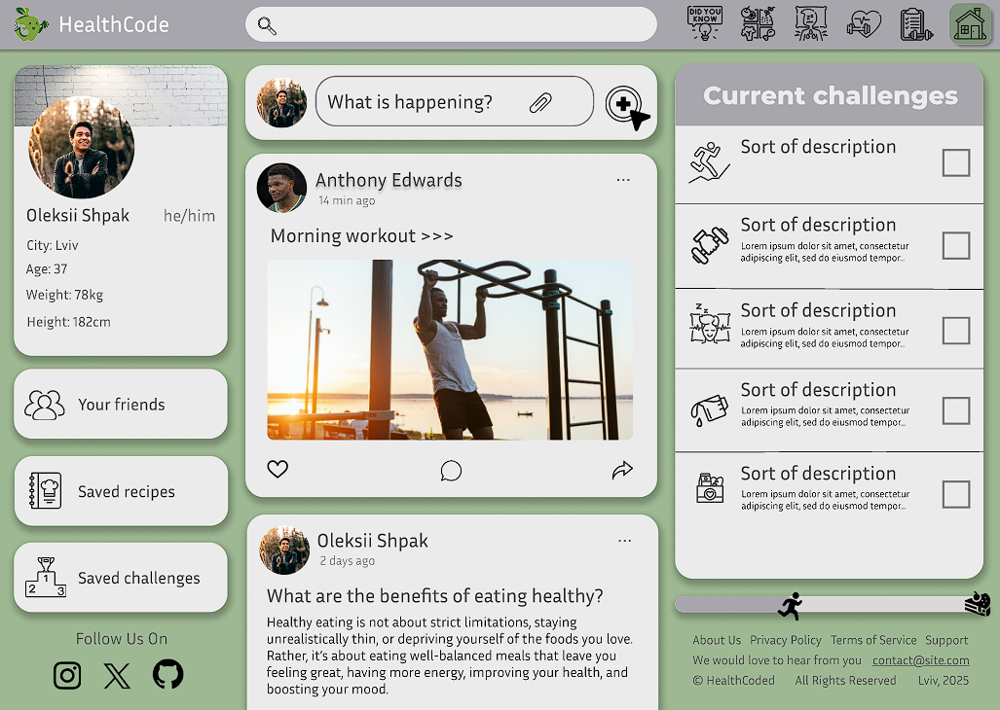
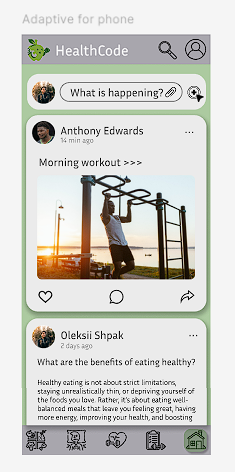
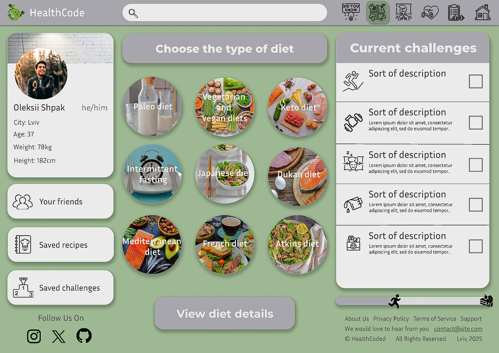
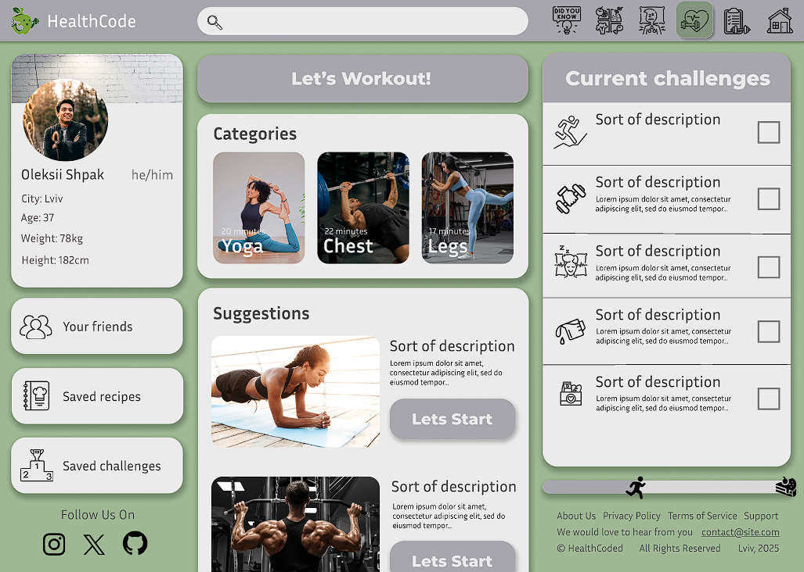
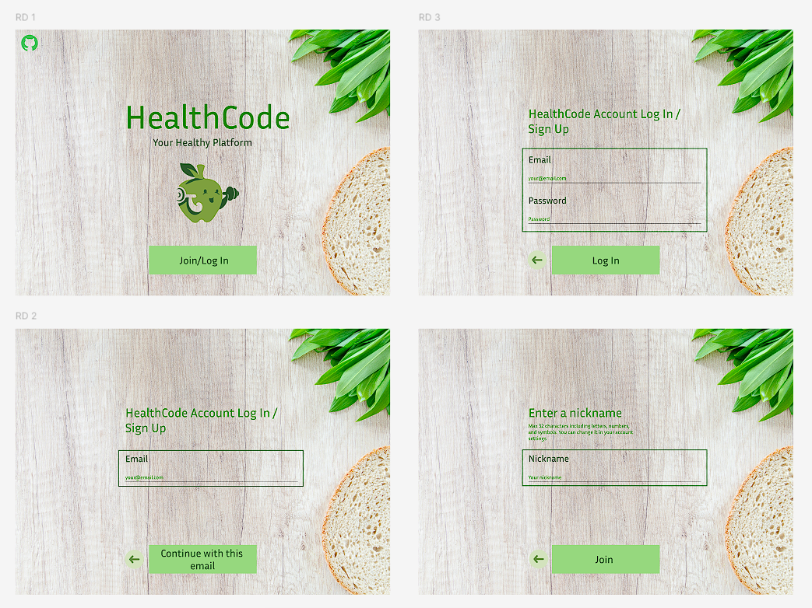
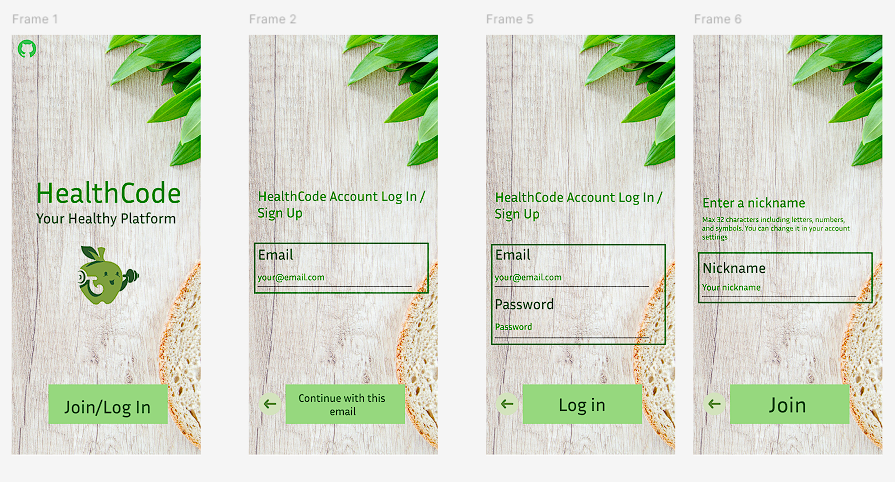
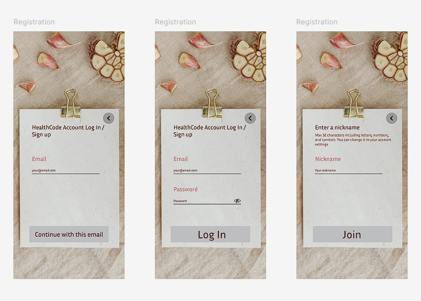

# 🌿 HealthCode Web App

HealthCode is a social platform for those who prioritize well-being. 
It brings together like-minded individuals, offering health tracking, 
nutrition tips, workout insights, and a supportive community—all in one place.

## 🔗 Live Demo 
**[visit demo app here 📌](https://health-code-client-nef5.vercel.app/)** 

## 🎯 Features  
✔ Track health metrics (sleep, nutrition, hydration)  
✔ Get personalized diet and workout recommendations  
✔ Engage in a supportive community (post updates, track achievements)  
✔ Manage your personal profile  

## 📸 UI Preview  
### 🏠 Homepage
#### 💻 Desktop View  


#### 📱 Mobile View  


---

### 🍏 Diets  


### 🏋️‍♂️ Workouts 


### 👤 User Profile 


---

### 🔐 Registration & Login  
#### 💻 Desktop View 


#### 📱 Mobile View  


#### 📝 Registration Form  


---

## 🛠 Tech Stack  
### 📌 Frontend  
- **React 18** — UI library  
- **Vite** — Build tool for fast development  
- **React Router** — Client-side navigation  
- **Tailwind CSS** — Utility-first styling  
- **DaisyUI** — UI components for Tailwind  
- **Lucide React** — Icon library  
- **Zustand** — State management  

### 📌 Backend  
- **Node.js** — JavaScript runtime for server-side logic  
- **Express.js** — Fast and minimalist web framework  
- **Sequelize** — ORM for MySQL database management  
- **MySQL2** — MySQL database driver  
- **jsonwebtoken (JWT)** — Authentication and authorization  
- **bcrypt.js** — Password hashing and security  
- **cookie-parser** — Parsing cookies for authentication  
- **cors** — Cross-Origin Resource Sharing middleware  
- **dotenv** — Environment variable management  
- **moment.js** — Date and time manipulation  
- **morgan** — HTTP request logger  

### 📌 Developer Tools  
- **Nodemon** — Auto-restarting for backend development  
- **ESLint** — Linting and code quality  
- **Prettier** — Code formatting  
- **PostCSS + Autoprefixer** — CSS processing  
- **Vite Plugin SVGR** — Importing SVG as React components  

## 🚀 Getting Started  

### 🖥️ Client Setup (Frontend)  

**1. Clone the repository:**  
```sh
git clone https://github.com/wastardy/health_code_client.git
cd health-code-client
```

**2. Install dependencies:**  
```sh
npm install
```

**3. Start the development server:**  
```sh
npm run dev
```
- By default, the app will be available at http://localhost:5173/.

**4. Build for production:**  
```sh
npm run build
```
- This will generate an optimized production build in the dist/ folder.
  
**5. Preview the production build:**  
```sh
npm run preview
```